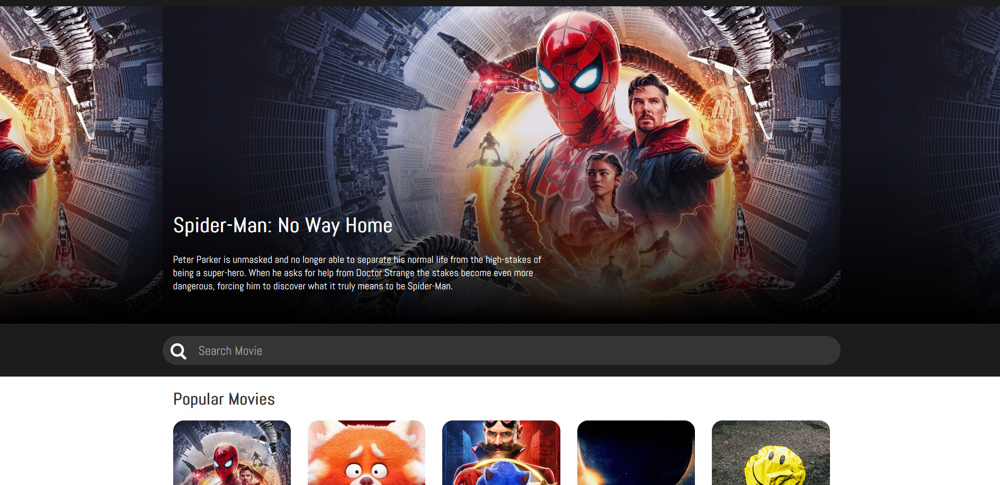

## LinkedIn: https://www.linkedin.com/in/federico-prat/  
## Web deployed: https://movies-place.netlify.app/
 
This web app fetches data from https://www.themoviedb.org.  
It was built using React and styled components  
I also added session storage inside the useEffect of the custom hooks that fetch the data so it optimizes speed and data transfer  
I am working on an authorization and user login system to rate movies and save them in favourites

